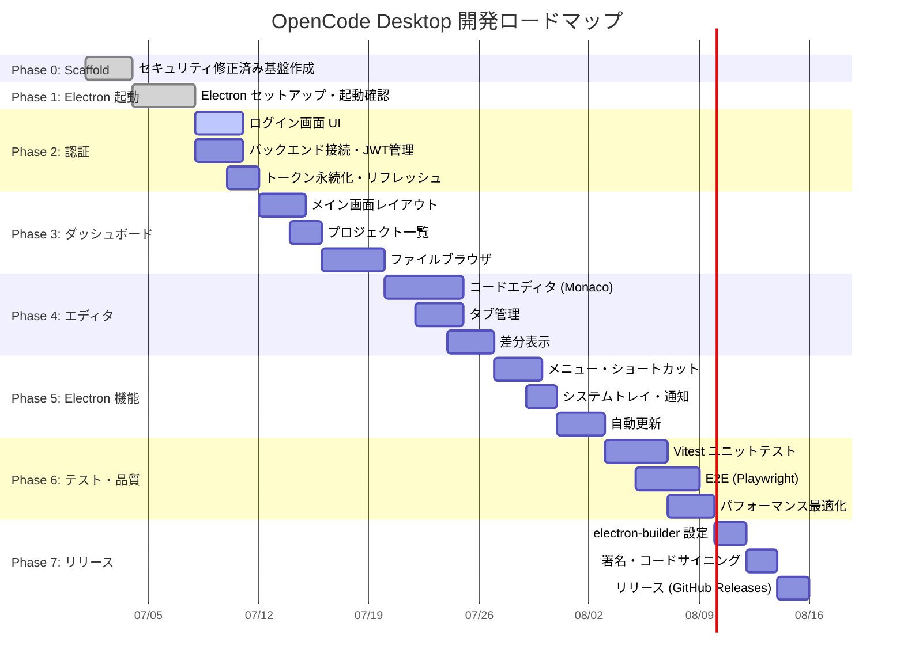

# OpenCode Desktop

SolidJS + Electron デスクトップアプリケーション

OpenCode_Rs バックエンドと連携する開発者向けデスクトップクライアント。

## ステータス

**Phase 1 完了 (2026-07-08)** ✅

- ✅ Phase 0: セキュリティ修正済み scaffold (Response Envelope 対応)
- ✅ Phase 1: Electron セットアップ + 起動確認

## 技術スタック

| カテゴリ | 技術 | バージョン |
|---------|------|-----------|
| Frontend | SolidJS | 1.9.x |
| Language | TypeScript | 5.4.x (strict mode) |
| Desktop | Electron | 31.x |
| State | SolidJS Store + TanStack Solid Query | 5.x |
| Build | Vite | 5.x |
| Plugin | vite-plugin-electron | 0.29.x |
| Storage | electron-store (暗号化対応) | 9.x |

## 必要環境

- **Node.js**: >= 20.11.0
- **npm**: >= 10.2.4
- **OS**: Windows 10+, macOS 11+, Ubuntu 20.04+

## セットアップ

### 1. 依存関係インストール

```bash
cd opencode-electron
npm install
```

### 2. 環境変数設定

`.env.example` を参考に `.env` を作成:

```bash
cp .env.example .env
```

**重要**: `OPENCODE_ENCRYPTION_KEY` は本番環境で必須です。

生成方法:

```bash
# PowerShell
node -e "console.log(require('crypto').randomBytes(32).toString('hex'))"

# OpenSSL
openssl rand -hex 32
```

### 3. 開発サーバー起動

```bash
npm run dev
```

Vite dev server と Electron ウィンドウが自動的に起動します。

- Vite: http://localhost:5173/
- Electron: 1200x800 ウィンドウ

## ビルド

### Windows

```bash
npm run build:win
```

成果物: `dist/` ディレクトリに `.exe` インストーラ

### macOS

```bash
npm run build:mac
```

成果物: `dist/` ディレクトリに `.dmg`

### Linux

```bash
npm run build:linux
```

成果物: `dist/` ディレクトリに `.AppImage` / `.deb`

### 全プラットフォーム

```bash
npm run build
```

## 開発コマンド

| コマンド | 説明 |
|---------|------|
| `npm run dev` | Vite dev server + Electron 起動 |
| `npx tsc --noEmit` | TypeScript 型チェック（0 errors 必須） |
| `npm run build` | 本番ビルド + electron-builder |
| `npm run preview` | ビルド成果物のプレビュー |

## セキュリティ機能

- ✅ 暗号化キーの環境変数化 (`OPENCODE_ENCRYPTION_KEY`)
- ✅ Electron `sandbox: true` 有効化
- ✅ Content Security Policy (CSP) 設定
- ✅ IPC チャネルの型安全化 (`StoreKey` union)
- ✅ electron-store 暗号化 (AES-256)
- ✅ JWT 自動リフレッシュ (401 検出 → 1回リトライ)
- ✅ リクエストタイムアウト (10秒, AbortController)
- ✅ `contextIsolation: true`, `nodeIntegration: false`

## API 仕様 (Response Envelope)

すべての API レスポンスは `ApiResponse<T>` 型でラップ:

```typescript
// 成功
{
  status: "success",
  data: T,
  error: null,
  timestamp?: string
}

// エラー (別形式)
{
  code: number,
  error: string
}
```

詳細は `src/renderer/types/api.ts` を参照。

## ディレクトリ構造

```
opencode-electron/
├── electron/
│   ├── main/
│   │   └── index.ts          # Electron メインプロセス
│   └── preload/
│       └── index.ts          # Preload スクリプト (IPC 橋渡し)
├── src/
│   └── renderer/
│       ├── App.tsx           # ルートコンポーネント
│       ├── main.tsx          # SolidJS エントリ
│       ├── index.html        # HTML テンプレート
│       ├── services/
│       │   └── api.ts        # API クライアント (Response Envelope 対応)
│       ├── store/
│       │   ├── auth.ts       # 認証状態 (SolidJS Store)
│       │   └── ui.ts         # UI 状態
│       └── types/
│           ├── api.ts        # API 型定義 (ApiResponse<T>)
│           └── electron.d.ts # Electron 型定義
├── dist-electron/            # ビルド成果物 (main, preload)
├── dist/                     # レンダラービルド成果物
├── index.html                # Vite エントリ HTML
├── vite.config.ts            # Vite + Electron 設定
├── tsconfig.json             # TypeScript 設定
├── package.json              # 依存関係
├── .env.example              # 環境変数テンプレート
└── README.md                 # このファイル
```

## 🗺️ 開発ロードマップ

OpenCode Desktop の開発は段階的に進めています。以下が完成までの全体計画です。



### 各フェーズの詳細

| # | フェーズ | マイルストーン | 成果物 | 依存 |
|:-:|---------|--------------|--------|:----:|
| 0 | 🏗️ **Scaffold** ✅ | 01. セキュリティ修正済み基盤 | 型定義・APIクライアント・Store・ESLint | – |
| 1 | 🚀 **Electron 起動** ✅ | 02. ウィンドウ起動確認 | Electron main/preload + Vite 統合 | Phase 0 |
| 2 | 🔐 **認証画面** | 03. ログイン/ログアウト可能 | ログインフォーム + JWT管理 + トークン永続化 | Phase 1 |
| 3 | 📊 **ダッシュボード** | 04. プロジェクト一覧表示 | メインレイアウト + プロジェクト一覧 + ファイルブラウザ | Phase 2 |
| 4 | ✏️ **エディタ** | 05. コード編集・差分可能 | Monaco Editor + タブ管理 + Diff表示 | Phase 3 |
| 5 | ⚙️ **Electron 機能** | 06. デスクトップアプリとして完成 | メニューバー + ショートカットキー + トレイ・通知・自動更新 | Phase 1 |
| 6 | 🧪 **テスト・品質** | 07. CI パス済み | Vitest ユニットテスト + Playwright E2E + パフォーマンス計測 | Phase 0–5 |
| 7 | 📦 **リリース** | 08. 公開リリース | .exe/.dmg/.AppImage インストーラ + GitHub Releases | Phase 6 |

---

### Phase 2: 認証画面 🔐 (現在)

**目標**: バックエンドにログインし、JWT を永続化して自動リフレッシュできる

- [ ] ログインフォーム UI（ユーザー名 + パスワード + ログインボタン）
- [ ] バックエンド `/api/v1/auth/login` 接続
- [ ] JWT トークンの electron-store 暗号化保存
- [ ] トークン有効期限チェック + 自動リフレッシュ
- [ ] ログアウト機能（トークン破棄）
- [ ] ローディング状態・エラー表示

**チェックポイント**: `npm run dev` でログイン画面が表示され、バックエンドにログインできる

---

### Phase 3: ダッシュボード 📊

**目標**: プロジェクト一覧・ファイルブラウザ・各種管理画面

- [ ] メインレイアウト（サイドバー + メインコンテンツ）
- [ ] プロジェクト一覧画面（`GET /api/v1/projects`）
- [ ] ファイルブラウザ（ツリー表示）
- [ ] ファイルアップロード UI
- [ ] ファイル検索・フィルタ
- [ ] ルーティング設定（`@solidjs/router`）

**チェックポイント**: ログイン後にダッシュボード画面が表示される

---

### Phase 4: エディタ ✏️

**目標**: コード編集・差分表示・タブ管理

- [ ] Monaco Editor 統合 (`@monaco-editor/react` → SolidJS port / iframe)
- [ ] タブ管理（開いているファイルの切り替え）
- [ ] ファイル保存（Ctrl+S → バックエンド連携）
- [ ] Git 差分表示（追加行・削除行のハイライト）
- [ ] シンタックスハイライト（言語自動判別）
- [ ] 検索・置換（Ctrl+F）

**チェックポイント**: ファイルを開いて編集・保存できる

---

### Phase 5: Electron 機能 ⚙️

**目標**: デスクトップアプリとしての完成形

- [ ] アプリケーションメニュー（ファイル・編集・表示・ヘルプ）
- [ ] キーボードショートカット（Ctrl+N, Ctrl+W, Ctrl+Tab）
- [ ] システムトレイアイコン（バックグラウンド動作）
- [ ] デスクトップ通知（ビルド完了・エラー）
- [ ] 自動更新（electron-updater + GitHub Releases）
- [ ] ウィンドウ状態保存（位置・サイズ・最大化）
- [ ] ネイティブファイルダイアログ（開く・保存）

**チェックポイント**: 他のデスクトップ開発ツールと同等の UX

---

### Phase 6: テスト・品質 🧪

**目標**: 自動テスト・品質メトリクス・パフォーマンス最適化

- [ ] Vitest ユニットテスト（Store / API クライアント）
- [ ] Playwright E2E（ログインフロー・ファイル操作）
- [ ] Electron テスト（electron-mock-ipc または custom テスト）
- [ ] 型チェック CI（`tsc --noEmit`）
- [ ] バンドルサイズ最適化（Vite チャンク分割）
- [ ] アクセシビリティ（a11y）対応
- [ ] エラーバウンダリ・ログ集約

**チェックポイント**: `npm test && npx tsc --noEmit` が CI でパス

---

### Phase 7: リリース 📦

**目標**: プロダクションリリース

- [ ] electron-builder 設定（NSIS / DMG / AppImage）
- [ ] コードサイニング（Windows: EV Cert, macOS: Apple Developer）
- [ ] GitHub Releases 自動公開 (CI/CD)
- [ ] インストーラテスト（クリーンインストール・アップデート）
- [ ] ドキュメント最終化（CHANGELOG / UPGRADE.md）
- [ ] プライバシーポリシー・利用規約

**チェックポイント**: インストーラをダウンロードしてインストール・利用できる

---

### マイルストーン一覧

| マイルストーン | 目標日 | ステータス |
|--------------|--------|:---------:|
| MS1: セキュリティ修正済み基盤 | 2026-07-03 | ✅ Done |
| MS2: Electron ウィンドウ起動 | 2026-07-07 | ✅ Done |
| MS3: ログイン・認証フロー | 2026-07-12 | 🔄 Current |
| MS4: ダッシュボード表示 | 2026-07-18 | ⏳ |
| MS5: コードエディタ | 2026-07-25 | ⏳ |
| MS6: デスクトップ機能 | 2026-08-01 | ⏳ |
| MS7: テスト完了 | 2026-08-07 | ⏳ |
| MS8: 公開リリース 🎉 | 2026-08-14 | ⏳ |

### 完了条件

| 基準 | 説明 |
|------|------|
| 🎯 **機能** | 認証 → ダッシュボード → ファイル編集 → Git 操作の全フローが動作 |
| 🧪 **品質** | ユニットテスト + E2E テスト CI パス + TypeScript 0 errors |
| 📦 **配布** | Windows / macOS / Linux インストーラが GitHub Releases で提供可能 |
| 🔒 **セキュリティ** | 暗号化保存・CSP・sandbox・自動更新署名のすべてが有効 |

---

### バックエンド (OpenCode_Rs) との関係

```
┌─────────────────────────────────────────────────┐
│               OpenCode Desktop                  │
│  (SolidJS + Electron → ポート 5173)              │
├─────────────────────────────────────────────────┤
│  Phase 2: 認証     →  POST /api/v1/auth/*       │
│  Phase 3: ダッシュ   →  GET /api/v1/projects,   │
│              ボード      /api/v1/files/*        │
│  Phase 4: エディタ  →  GET/PUT /api/v1/files/*  │
│  Phase 5: 管理機能   →  GET/POST /api/v1/config  │
└─────────────────────────────────────────────────┘
                         ▲
                         │ HTTP (JWT Bearer Auth)
                         ▼
┌─────────────────────────────────────────────────┐
│                OpenCode_Rs API                   │
│         (Rust/Actix → ポート 8080)               │
│  PoC: SQLite / 本番: PostgreSQL + S3/MinIO      │
└─────────────────────────────────────────────────┘
```

### 更新履歴

| 日付 | 更新内容 |
|------|---------|
| 2026-07-08 | 🗺️ ロードマップ初版作成 (Phases 2–7 詳細化) |
| 2026-07-07 | Phase 1 完了に伴うステータス更新 |
| 2026-07-03 | Phase 0 完了に伴うステータス更新 |

## トラブルシューティング

### `npm run dev` で画面が白い

1. `Ctrl+C` で停止
2. `rm -rf node_modules package-lock.json`
3. `npm install` 再実行
4. `npm run dev` 再実行

### `Error: EADDRINUSE: address already in use :::5173`

ポート 5173 が使用中。`vite.config.ts` の `server.port` を変更:

```typescript
server: {
  port: 5174
}
```

### TypeScript エラー

```bash
npx tsc --noEmit
```

エラー内容に応じて `tsconfig.json` の `strict` 設定を確認。

## ライセンス

MIT

## 関連プロジェクト

- [OpenCode_Rs (バックエンド)](https://github.com/HHKK0127/Opencode_Rs)
  - Rust 実装の API サーバー
  - エンドポイント: `/api/v1/auth/*`, `/api/v1/files/*`

## 貢献

1. このリポジトリをフォーク
2. 機能ブランチを作成 (`git checkout -b feature/amazing-feature`)
3. 変更をコミット (`git commit -m 'feat: add amazing feature'`)
4. ブランチをプッシュ (`git push origin feature/amazing-feature`)
5. プルリクエストを作成
